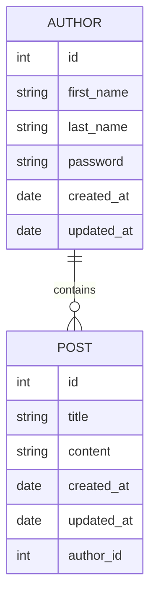

# はじめに

Spring Data RESTというライブラリを仕事で利用することになりそうで、色々手を動かして調べた要点や利用方法についてまとめました。

# Spring Data RESTとは

[Spring Data REST](https://spring.pleiades.io/spring-data/rest/reference/)はSpring Dataのライブラリの一つであり、Spring Data RESTは、Spring Dataで作成したリポジトリをRESTfulなエンドポイントとして自動的に公開します。Spring Data RESTの機能を利用することによって、ControllerやServiceクラスの実装を省略する事ができるということです。

Spring Dataは様々なデータストアの特性や仕様を抽象化し、簡便なインターフェースを提供しています。例えば、RDBMSの場合、[JPA](https://spring.pleiades.io/projects/spring-data-jpa)を使用していれば、Entityクラスを定義し、そのEntityクラスを元にRepositoryクラスを作成するだけで、CRUDの処理が可能になります。

例えば、RDBMSを利用する場合、`user`テーブルは以下のようなJavaのオブジェクト(Entityクラス)にマッピングすることができます。

```java
@Entity
public class User {
  @Id
  private Long id;
  private String name;
  private Integer age;
  // getter, setter
}
```

そして、Repositoryクラスは以下のように、JPAが提供するインターフェースを継承することで様々なCRUD操作を実現するためのメソッドを利用することができるようになります。

```java
public interface UserRepository extends JpaRepository<User,Long> {}
```

この`UserRepository`には、`findAll`や`findById`や`save`や`deleteById`などの基本的なCRUD操作を実現するメソッドが継承されており、これらのメソッドを利用することで、ユーザー情報の取得・保存・削除などの処理を行うことができます。

Spring Data RESTはこのように定義されたRepository群をRESTfulなAPIエンドポイントとして公開してくれるライブラリだということです(ControllerやServiceクラスの実装が必要なくなるということです)。

# Spring Data RESTの機能紹介

Spring Data RESTは、開発者がより効率的にデータを管理し、RESTful APIを提供するための強力なツールです。以下に、Spring Data RESTの重要な機能を3つ紹介します。

1. **CRUD操作の自動生成**: Spring Data RESTは、リポジトリインターフェースを定義するだけで、自動的にCRUD（Create, Read, Update, Delete）の操作をサポートするRESTfulエンドポイントを生成します。これにより、開発者はデータの管理に関する大量のコードを手動で書く必要がなくなり、開発時間を大幅に短縮できます。

具体的にはCRUD操作とエンドポイントとJPAメソッドは以下のように対応しています。

| 操作       | HTTPメソッド | エンドポイント | JPAメソッド       |
|------------|--------------|----------------|-------------------|
| 作成(Create)| POST         | /entities      | save              |
| 読み取り(Read All) | GET          | /entities      | findAll           |
| 読み取り(Read One) | GET          | /entities/{id} | findById          |
| 更新(Update) | PUT/PATCH   | /entities/{id} | save              |
| 削除(Delete) | DELETE       | /entities/{id} | deleteById        |


2. **ページングとソート**: データの量が多い場合、ページングとソート機能は非常に重要です。Spring Data RESTは、標準でページングとソートをサポートしており、クライアントからのリクエストに応じてデータを適切に分割および並べ替えることができます。これにより、大量のデータを効率的に扱うことが可能になります。

具体的にはページングやソートを利用する場合にはGETエンドポイントに対してクエリパラメータを付与します。例として以下のようなクエリパラメータを使用します。

- ページング:
  - `?page=0&size=10` (例: 最初のページの10件を取得)
- ソート:
  - `?sort=name,asc` (例: 名前順で昇順)
  - `?sort=age,desc` (例: 年齢順で降順)

3. **クエリメソッドのサポート**: Spring Data RESTは、リポジトリインターフェースに定義されたメソッドを直接RESTfulエンドポイントにマッピングすることで、クエリメソッドをサポートします。これにより、複雑な検索条件や計算式をクライアントが直接指定できるようになり、データの取得がより柔軟になります。

具体的にはクエリメソッドは以下のようにエンドポイントとしてマッピングされます。

例: `UserRepository`にdefinedされるクエリメソッド、例えば`findByName`は`/users/search/findByName?name={name}`というエンドポイントにマッピングされます。

- クエリメソッドの定義:
```java
public interface UserRepository extends JpaRepository<User, Long> {
  List<User> findByName(String name);
}
```
- エンドポイントの呼び出し例:
```
GET /users/search/findByName?name=John
```

他にも様々な機能があるのですが、今回はこの3つの機能にフォーカスして紹介したいと思います。

# 簡単なエンドポイントの作成

## 今回実装したもの

ソースコードはこちらにあります。  

https://github.com/Showichiro/spring-data-rest-example-for-qiita

Spring Bootのアプリケーションを作成しています。データベースはH2DBを利用して簡単に試すことができるようになっています。  
いくつかテストデータも自動で投入されるようになっているので色々触ってみてください。

コンソール上でDBを確認したり、APIのエンドポイントを確認できるようになっています。

アプリを起動している状態で以下のURLにアクセスしてください。
- DB  
`http://localhost:8080/h2-console`
- API  
`http://localhost:8080/swagger-ui/index.html`

DBのコンソールで入力を求められた場合は以下の内容を入力してください。

|項目名|入力内容|
|--------------|---------------|
| Driver Class | org.h2.Driver |
| JDBC URL     | jdbc:h2:mem:testdb |
| User Name    | sa |
| Password     |  |

Javaのバージョンは21を指定しています。

以下、実装のテーマ設定や要点について説明していきます。

## テーマ設定

AuthorとPostというテーブルを利用するアプリケーションを考えます。Authorは複数のPostを持ちうるというリレーションを持つとします。



## 実装

### Entityを実装する

これをJPAのEntityとして表現すると以下のようになります。

```java
@Data
@Entity
public class Author {
    @Id
    @GeneratedValue(strategy = GenerationType.AUTO)
    private Long id;
    private String firstName;
    private String lastName;
    private String password;
    @CreatedDate
    private LocalDate createdAt;
    @LastModifiedDate
    private LocalDate updatedAt;

    @OneToMany(cascade = CascadeType.ALL)
    @JoinColumn(name = "author_id")
    private List<Post> posts = new ArrayList<>();
}
```

```java
@Data
@Entity
public class Post {
    @Id
    @GeneratedValue(strategy = GenerationType.AUTO)
    private Long id;
    private String title;
    private String content;
    @ManyToOne
    @JoinColumn(name = "author_id")
    private Author author;
    @CreatedDate
    private LocalDate createdAt;
    @LastModifiedDate
    private LocalDate updatedAt;
}
```

### Repositoryを実装する

これらのテーブルに対応するRepositoryを作成します。

```java
public interface AuthorRepository extends JpaRepository<Author, Long> {
}
```

```java
public interface PostRepository extends JpaRepository<Post, Long> {
}
```

### 自動で公開されるエンドポイント

これらの実装によって、以下のエンドポイントが作られます。

| エンドポイント                     | HTTPメソッド | JPAのメソッド | 対象Entity |
|------------------------------------|--------------|------------|-------------|
| `/authors`                         | GET          | findAll    | Author      |
| `/authors/{id}`                    | GET          | findById   | Author      |
| `/authors`                         | POST         | save       | Author      |
| `/authors/{id}`                    | PUT/PATCH    | save       | Author      |
| `/authors/{id}`                    | DELETE       | deleteById | Author      |
| `/posts`                           | GET          | findAll    | Post        |
| `/posts/{id}`                      | GET          | findById   | Post        |
| `/posts`                           | POST         | save       | Post        |
| `/posts/{id}`                      | PUT/PATCH    | save       | Post        |
| `/posts/{id}`                      | DELETE       | deleteById | Post        |

また、今回のようにリレーションが定義されている場合、RESTのリソースの親子関係の形でリレーション先のリソースにアクセスするエンドポイントも自動で作られます。

| エンドポイント                        | HTTPメソッド | 概要                                                                                   |
|---------------------------------------|--------------|----------------------------------------------------------------------------------------|
| `/authors/{id}/posts`                 | GET          | 特定の著者に関連するすべての投稿を取得するエンドポイント                          |
| `/posts/{id}/author`                  | GET          | 特定の投稿に関連する著者を取得するエンドポイント                                     |

この状態でアプリを起動してエンドポイントを呼び出すと以下のようなレスポンスが返却されます。

- request
`http://localhost:8080/authors`

- response

```json
{
  "_embedded": {
    "authors": [
      {
        "firstName": "John",
        "lastName": "Doe",
        "password": "password123",
        "createdAt": "2024-05-23",
        "updatedAt": "2024-05-23",
        "_links": {
          "self": {
            "href": "http://localhost:8080/authors/1"
          },
          "author": {
            "href": "http://localhost:8080/authors/1"
          },
          "posts": {
            "href": "http://localhost:8080/authors/1/posts"
          }
        }
      },
      {
        "firstName": "Jane",
        "lastName": "Smith",
        "password": "password456",
        "createdAt": "2024-05-23",
        "updatedAt": "2024-05-23",
        "_links": {
          "self": {
            "href": "http://localhost:8080/authors/2"
          },
          "author": {
            "href": "http://localhost:8080/authors/2"
          },
          "posts": {
            "href": "http://localhost:8080/authors/2/posts"
          }
        }
      },
      {
        "firstName": "Alice",
        "lastName": "Johnson",
        "password": "password789",
        "createdAt": "2024-05-23",
        "updatedAt": "2024-05-23",
        "_links": {
          "self": {
            "href": "http://localhost:8080/authors/3"
          },
          "author": {
            "href": "http://localhost:8080/authors/3"
          },
          "posts": {
            "href": "http://localhost:8080/authors/3/posts"
          }
        }
      }
    ]
  },
  "_links": {
    "self": {
      "href": "http://localhost:8080/authors?page=0&size=20"
    },
    "profile": {
      "href": "http://localhost:8080/profile/authors"
    }
  },
  "page": {
    "size": 20,
    "totalElements": 3,
    "totalPages": 1,
    "number": 0
  }
}
```

このように取得したリソースやトータルの件数などが返却されていることがわかります。このレスポンスは、HATEOAS（Hypermedia as the Engine of Application State）の原則に従っています。

### ページング・ソート

また、一覧を取得するエンドポイントでは、クエリパラメータに`page`と`size`を指定することでページングを実現したり、sortというパラメータに`{param名},{asc/desc}`という形で指定することでソートを実現できます。

例えば以下のようなリクエストを行うことができます。

- **http://localhost:8080/authors?page=1&size=20** :ページングする場合
- **http://localhost:8080/authors?sort=firstName,asc** :first_nameでソートする場合


### 除外項目の設定

例えばAuthorの`password`はAPIの返却項目としたくない場合は多いでしょう。APIのレスポンス項目に含めたくないプロパティには`@JsonIgnore`というアノテーションを付けることで返却しないようにする事ができます。

```java
@Data
@Entity
public class Author {
    @Id
    @GeneratedValue(strategy = GenerationType.AUTO)
    private Long id;
    private String firstName;
    private String lastName;
    @JsonIgnore
    private String password;
    @CreatedDate
    @JsonIgnore
    private LocalDate createdAt;
    @LastModifiedDate
    @JsonIgnore
    private LocalDate updatedAt;

    @OneToMany(cascade = CascadeType.ALL)
    @JoinColumn(name = "author_id")
    private List<Post> posts = new ArrayList<>();
}
```

このように`@JsonIgnore`をつけることで返却項目から除外することができます。実際にこの状態で呼んでみると`password`などが返却されないようになります。

```json
{
  "_embedded": {
    "authors": [
      {
        "firstName": "John",
        "lastName": "Doe",
        "_links": {
          "self": {
            "href": "http://localhost:8080/authors/1"
          },
          "author": {
            "href": "http://localhost:8080/authors/1"
          },
          "posts": {
            "href": "http://localhost:8080/authors/1/posts"
          }
        }
      },
      {
        "firstName": "Jane",
        "lastName": "Smith",
        "_links": {
          "self": {
            "href": "http://localhost:8080/authors/2"
          },
          "author": {
            "href": "http://localhost:8080/authors/2"
          },
          "posts": {
            "href": "http://localhost:8080/authors/2/posts"
          }
        }
      },
      {
        "firstName": "Alice",
        "lastName": "Johnson",
        "_links": {
          "self": {
            "href": "http://localhost:8080/authors/3"
          },
          "author": {
            "href": "http://localhost:8080/authors/3"
          },
          "posts": {
            "href": "http://localhost:8080/authors/3/posts"
          }
        }
      }
    ]
  },
  "_links": {
    "self": {
      "href": "http://localhost:8080/authors?page=0&size=20"
    },
    "profile": {
      "href": "http://localhost:8080/profile/authors"
    }
  },
  "page": {
    "size": 20,
    "totalElements": 3,
    "totalPages": 1,
    "number": 0
  }
}
```

### エンドポイントのカスタマイズ

#### 公開しないエンドポイントの設定

例えば、論理削除する設計のため、deleteのエンドポイントを作らないという場合、物理削除する`DELETE`エンドポイントは公開したくありません。このように公開したくないエンドポイントに対しては`@RestResource`というアノテーションを利用して設定します。

```java
public interface AuthorRepository extends JpaRepository<Author, Long> {
    @Override
    @RestResource(exported = false)
    void deleteById(Long id);
}
```

Repositoryのメソッドベースでエンドポイントを自動で実装してくれるというライブラリですので、対応するメソッドに対してアノテーションを設定することで公開しないようにすることができます。  
また、Repository全体の公開を設定することや、デフォルトの公開設定を設定することもできます。


#### クエリメソッドのエンドポイントの実装

JPAにはメソッド名や`@Query`というアノテーションによって、細かくクエリの内容を制御する機能があります。そして、Spring Data RESTもこの機能に対応しています。

例えば、Postのタイトルに特定の文字列が含まれているものだけを抽出するというクエリを実装する場合は以下のようにクエリメソッドを設定します。

```java
public interface PostRepository extends JpaRepository<Post, Long> {
    public List<Post> findByTitleContaining(String word);
}
```

Spring Data RESTはこの内容をエンドポイントとして公開します。具体的には以下のようなエンドポイントが生えてきます。
| エンドポイント                        | HTTPメソッド | 必須パラメータ | 概要                                                                                   |
|---------------------------------------|--------------|-----------------|----------------------------------------------------------------------------------------|
| `/posts/search/findByTitleContaining` | GET          | `word`          | タイトルに特定の文字列が含まれている投稿を検索するエンドポイント                       |

このようにして具体的なエンドポイントを設定することができます。


# その他の機能について

公式リファレンスのうち、利用頻度の多そうな内容を抜粋してリンクを置いておきます。

- 値を加工・抜粋する  
https://spring.pleiades.io/spring-data/rest/reference/projections-excerpts.html
- Spring Securityとの統合  
https://spring.pleiades.io/spring-data/rest/reference/security.html
- Validatorとの統合  
https://spring.pleiades.io/spring-data/rest/reference/validation.html
